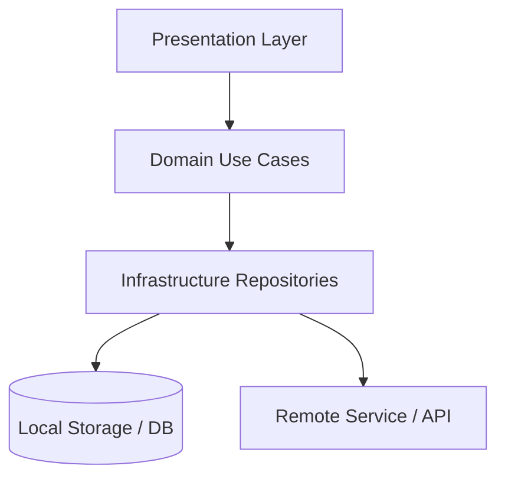

# 🏛️ Arquitectura Global del Proyecto — [Nombre del Proyecto]

> Última actualización: YYYY-MM-DD (Auditoría `$archi`: Cobertura 100% modularizada en `overview/architecture/`)

## 1. Visión General y Capas del Sistema (Clean Architecture)

| Capa | Ubicación | Descripción Breve |
|---|---|---|
| **Presentation** | `lib/presentation/` | Pantallas, widgets modulares y notificadores de estado |
| **Domain** | `lib/domain/` | Entidades puras y casos de uso de negocio |
| **Infrastructure** | `lib/infrastructure/` | Repositorios, adaptadores de DB local y servicios de red |
| **Core** | `lib/core/` | Router, temas visuales y utilidades compartidas |

## 2. Diagrama de Estado y Persistencia Global

## 3. Índice de Módulos (Subdocumentos de Dominio)
* 📦 **[Módulo Principal](./architecture/modules/principal.md):** Especificación técnica y flujo operativo principal.

## 4. Guías Transversales
* 🧭 **[Mapa Global de Rutas](./architecture/routes_map.md)** — Enrutamiento GoRouter y navegación del sistema.
* 🔄 **[Flujo de Datos Local-First](./architecture/core/data_flow.md)** — Riverpod/Hive, sync y persistencia.
* 📏 **[Reglas de Importación](./architecture/core/import_rules.md)** — Convenciones de capas e importaciones.
